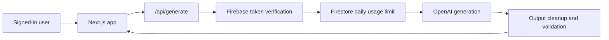

# MindMint

AI study workspace that turns raw notes or topics into mind maps, flashcards, quizzes, summaries, and infographics.

**Live:** [mindmint.study](https://mindmint.study)

---

## What It Does

- Converts pasted study material into multiple learning formats.
- Renders visual mind maps with Mermaid.js.
- Generates flashcards and quizzes for active recall.
- Exports study material as PDF or PNG.
- Saves user notes behind Firebase authentication.
- Enforces a daily generation limit server-side.

## Tech Stack

| Layer | Choice |
| --- | --- |
| Framework | Next.js 15, React 19, TypeScript |
| Styling | Tailwind CSS v4 |
| AI | OpenAI via server-side API routes |
| Auth and data | Firebase Auth, Firestore |
| Rendering | Mermaid.js |
| Export | jsPDF, html-to-image |
| Deployment | Vercel |
| PWA | Web app manifest, service worker |

## Architecture



Core design choices:

- The OpenAI key is server-only and never sent to the browser.
- Firebase ID tokens are verified before content generation.
- Usage limits are enforced in a Firestore transaction to reduce race conditions.
- User input is sanitized before it is sent to the model.
- Mermaid output is normalized before rendering to reduce parser failures.

See [docs/architecture.md](docs/architecture.md) for more detail.

## Run Locally

**Prerequisites:** Node.js 20+ and Firebase project credentials.

1. Install dependencies:

   ```bash
   npm install
   ```

2. Set up environment variables:

   ```bash
   cp .env.local.example .env.local
   ```

3. Add Firebase client config, Firebase Admin service account JSON, and an OpenAI API key.

4. Start the dev server:

   ```bash
   npm run dev
   ```

Open [http://localhost:3000](http://localhost:3000).

## Quality Checks

```bash
npm run lint
npm run typecheck
npm run build
npm run audit:high
```

`npm run check` runs linting, type checking, and a production build.

## Cost and Performance Notes

AI generation calls OpenAI from the server, so every successful request has API cost. The app limits free users to a daily quota and validates input size before generation. For production, monitor token usage and model latency before raising limits.

Exports run in the browser and can be CPU-heavy for large visual outputs. Keep generated diagrams compact enough for mobile devices.

## Security Notes

- Do not commit `.env.local` or Firebase service account JSON files.
- Keep `OPENAI_API_KEY` server-only.
- Rotate credentials immediately if a real key is committed.
- Review `firestore.rules` before changing note storage or user data paths.

See [SECURITY.md](SECURITY.md) for reporting and operational guidance.

---

Built by [Aakash Gajbhiye](https://aakashbuild.vercel.app) / [@AakashBuild](https://x.com/AakashBuild)
