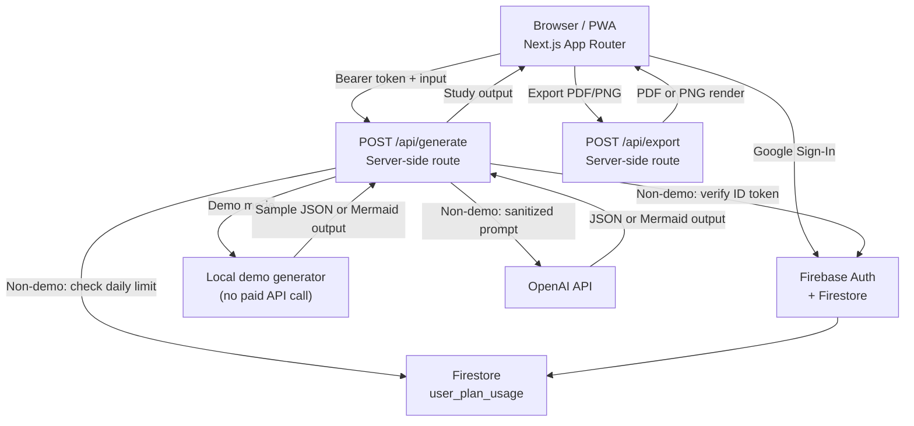

# Architecture — MindMint

MindMint is a Next.js PWA that converts text or topics into study tools: mind maps, flashcards, quizzes, summaries, and infographics.

The public portfolio deployment runs in demo mode by default. Demo mode returns deterministic local sample output, skips Firebase auth for generation, and does not call OpenAI, Gemini, or any paid model API. The real AI path remains available for future use behind `MINDMINT_DEMO_MODE=false`.



## Core Decisions

### 1. Demo Mode by Default

`MINDMINT_DEMO_MODE` defaults to enabled unless explicitly set to `false`. This keeps the public portfolio safe from API abuse and surprise billing while still showing the product workflow.

### 2. Server-Side Generation When Enabled

All OpenAI calls go through `app/api/generate/route.ts`. The client sends a Firebase ID token; the server verifies it, checks the daily limit, sanitizes input, then calls OpenAI. The API key lives only in server environment variables.

### 3. Firebase Auth and Usage Tracking

Auth uses Firebase Google Sign-In and email link flows. Daily usage is tracked in Firestore under `user_plan_usage/{uid}` when non-demo generation is enabled.

### 4. Server-Enforced Daily Limit

`lib/rateLimit.ts` checks usage against `DAILY_GENERATION_LIMIT` in non-demo mode. The client reflects remaining usage, but the server is the source of truth.

### 5. Prompt Injection Resistance

`lib/security.ts` sanitizes user input before it reaches the generation prompt. User content is wrapped and treated as data, not instruction.

### 6. One Interface, Five Modes

`lib/demoContent.ts` handles local sample output in demo mode. `lib/generateService.ts` handles mind maps, flashcards, quizzes, summaries, and infographics through one `generateContent()` function when real AI generation is enabled.

### 7. Defensive Mermaid Rendering

OpenAI output can contain characters that break Mermaid parsing. `sanitizeMermaid()` strips code fences, escapes problematic labels, and normalizes graph structure before rendering.

### 8. PWA-First Shell

`public/sw.js` registers a service worker and `public/manifest.json` configures installability with 192px and 512px icons.

## Key Files

| Path | Responsibility |
| --- | --- |
| `app/api/generate/route.ts` | Authenticated generation endpoint and rate-limit gate |
| `app/api/export/route.ts` | PDF/PNG export endpoint |
| `lib/demoContent.ts` | Local sample outputs for no-cost portfolio demo mode |
| `lib/demoMode.ts` | Demo mode feature flag |
| `lib/generateService.ts` | OpenAI client, prompt builder, Mermaid sanitizer, JSON cleaner |
| `lib/rateLimit.ts` | Daily limit policy |
| `lib/security.ts` | Input sanitization |
| `lib/firebase/admin.ts` | Firebase Admin SDK and token verification |
| `lib/firebase/config.ts` | Firebase client SDK init |
| `components/panels/` | Per-mode output renderers |
| `components/MindMintApp.tsx` | Main app shell |
| `public/sw.js` | PWA service worker |

## Output Modes

| Mode | Output Format | Renderer |
| --- | --- | --- |
| Mind Map | Mermaid.js syntax | `MindmapPanel.tsx` |
| Flashcards | JSON array | `FlashcardsPanel.tsx` |
| Quiz | JSON array | `QuizPanel.tsx` |
| Summary | Structured text | `SummaryPanel.tsx` |
| Infographic | Hierarchical JSON | `InfographicPanel.tsx` |

## Firestore Data Model

```text
user_plan_usage/{uid}
  daily_count          number
  last_generation_at   ISO timestamp
```

## Environment Variables

See `.env.local.example` for the full list.

| Variable | Where Used |
| --- | --- |
| `OPENAI_API_KEY` | `lib/generateService.ts`, server only |
| `MINDMINT_DEMO_MODE` | Server-side demo switch, defaults to enabled |
| `NEXT_PUBLIC_MINDMINT_DEMO_MODE` | Client-side demo UI switch, defaults to enabled |
| `NEXT_PUBLIC_FIREBASE_*` | `lib/firebase/config.ts`, client-safe Firebase config |
| `FIREBASE_SERVICE_ACCOUNT` | `lib/firebase/admin.ts`, server only |

## Cost and Performance

Demo mode has no model API cost. OpenAI usage becomes the main variable cost only when real AI mode is enabled. Input validation and daily limits protect against accidental high spend. Exporting large diagrams can be CPU-heavy on older devices, so generated visual output should stay compact.

## Deployment

- **Frontend and API routes:** Vercel
- **Auth and usage DB:** Firebase
- **Live URL:** https://mindmint.study
