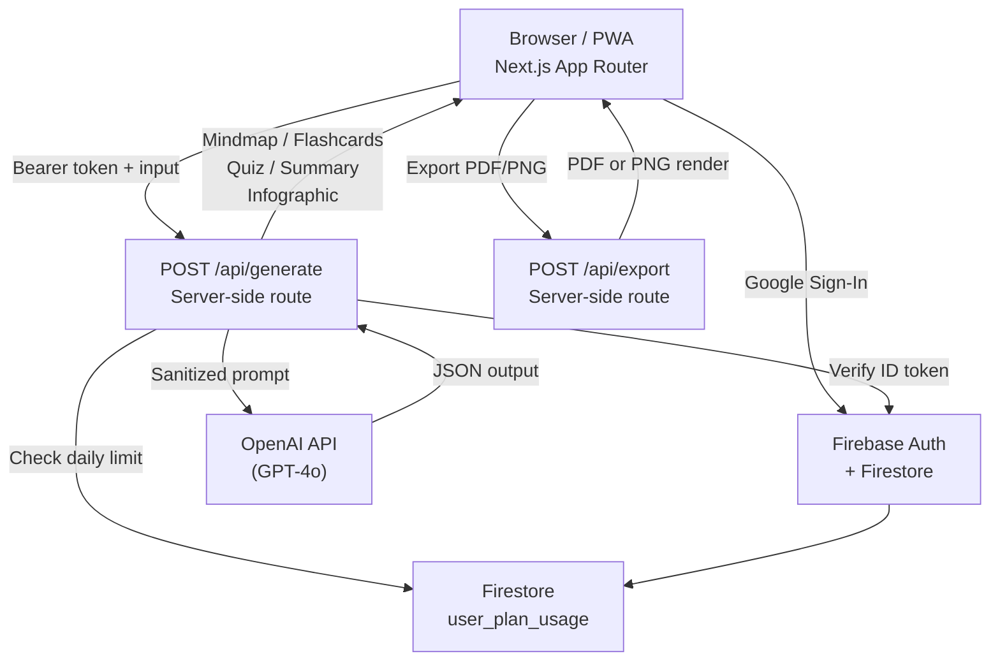

# Architecture — MindMint

## System Overview

MindMint is a Next.js PWA that converts any text or topic into study tools — mind maps, flashcards, quizzes, summaries, and infographics — powered by OpenAI. Auth and daily usage tracking run through Firebase. Content is generated server-side so the OpenAI key never reaches the client.



## Core Decisions

### 1. Server-side generation — OpenAI key never reaches the client

All OpenAI calls go through `app/api/generate/route.ts`. The client sends a Firebase ID token; the server verifies it, checks the daily limit, sanitizes the input, then calls OpenAI. The API key lives only in server env vars. This is essential — browser-exposed OpenAI keys get scraped and abused within hours.

### 2. Firebase for auth + usage, Supabase removed

Auth is Firebase (Google Sign-In + email link). Daily usage is tracked in Firestore under `user_plan_usage/{uid}`. Supabase was scaffolded early but never activated — `lib/supabase/` is a placeholder. All live data goes through Firebase.

### 3. Daily limit enforced server-side, not client-side

`lib/rateLimit.ts` checks `dailyUsageCount` against `DAILY_GENERATION_LIMIT = 5` on every generation request. The client UI reflects limits but the server never trusts the client's reported usage. Limit resets at UTC midnight.

### 4. Input sanitization before prompt injection

`lib/security.ts` sanitizes user input before it reaches the OpenAI prompt. This blocks prompt injection attacks where a malicious input tries to override the system prompt or extract the API key.

### 5. Five output modes from one generation service

`lib/generateService.ts` handles all five modes — mindmap, flashcards, quiz, summary, infographic — through a single `generateContent()` function that switches prompt strategy and expected JSON schema per mode. Each panel component (`components/panels/`) receives the typed output and renders independently.

### 6. Mermaid.js for mind maps with defensive sanitization

Mind maps render via Mermaid.js. OpenAI output frequently contains characters that break the Mermaid parser (`{}`, `[]`, `:`). `generateService.ts` includes a `sanitizeMermaid()` pass that strips and escapes problematic characters before passing to the renderer.

### 7. PWA-first — offline shell, installable

`public/sw.js` registers a service worker. `public/manifest.json` configures the PWA with 192px and 512px icons. The app is installable on Android and desktop.

## Key Files

| Path | Responsibility |
|---|---|
| `app/api/generate/route.ts` | Core endpoint — auth, rate limit, sanitize, call OpenAI |
| `app/api/export/route.ts` | PDF/PNG export endpoint |
| `lib/generateService.ts` | OpenAI client, prompt builder, Mermaid sanitizer, JSON cleaner |
| `lib/rateLimit.ts` | Daily limit logic (`DAILY_GENERATION_LIMIT = 5`) |
| `lib/security.ts` | Input sanitization against prompt injection |
| `lib/firebase/admin.ts` | Firebase Admin SDK — server-side token verify + Firestore writes |
| `lib/firebase/config.ts` | Firebase client SDK init |
| `components/panels/` | Per-mode output renderers (Mindmap, Flashcards, Quiz, Summary, Infographic) |
| `components/MindMintApp.tsx` | Main app shell — mode switcher, input, panel orchestration |
| `public/sw.js` | Service worker for PWA |

## Output Modes

| Mode | Output format | Renderer |
|---|---|---|
| Mind Map | Mermaid.js syntax | `MindmapPanel.tsx` |
| Flashcards | `[{ front, back }]` JSON array | `FlashcardsPanel.tsx` |
| Quiz | `[{ question, options[], answer }]` JSON array | `QuizPanel.tsx` |
| Summary | Structured text blocks | `SummaryPanel.tsx` |
| Infographic | Hierarchical JSON | `InfographicPanel.tsx` |

## Data Model (Firestore)

```
user_plan_usage/{uid}
  daily_usage_count    number
  last_generation_at   ISO timestamp
  last_reset_date      UTC date string
```

## Environment Variables

See `.env.local.example` for the full list.

| Var | Where used |
|---|---|
| `OPENAI_API_KEY` | `lib/generateService.ts` — server only |
| `NEXT_PUBLIC_FIREBASE_API_KEY` | `lib/firebase/config.ts` — client (safe, Firebase public key) |
| `FIREBASE_ADMIN_*` | `lib/firebase/admin.ts` — server only |

## Deployment

- **Frontend + API routes:** Vercel (Next.js App Router)
- **Auth + usage DB:** Firebase (Firestore)
- **Live URL:** https://mindmint.study
